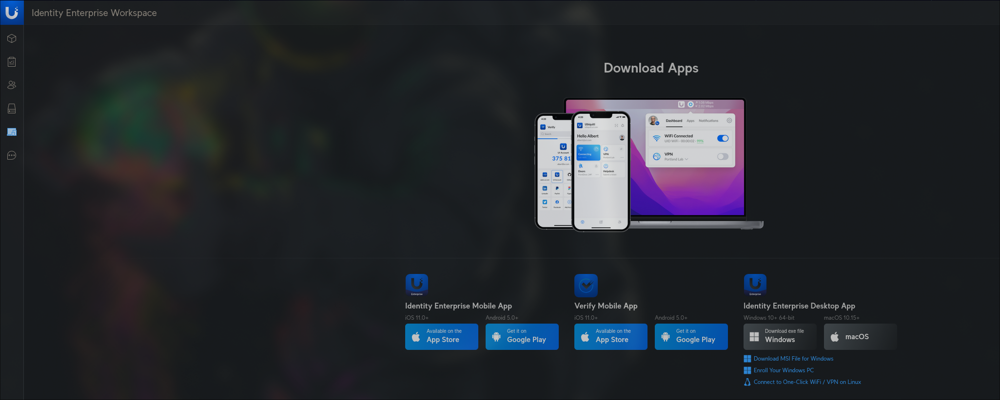
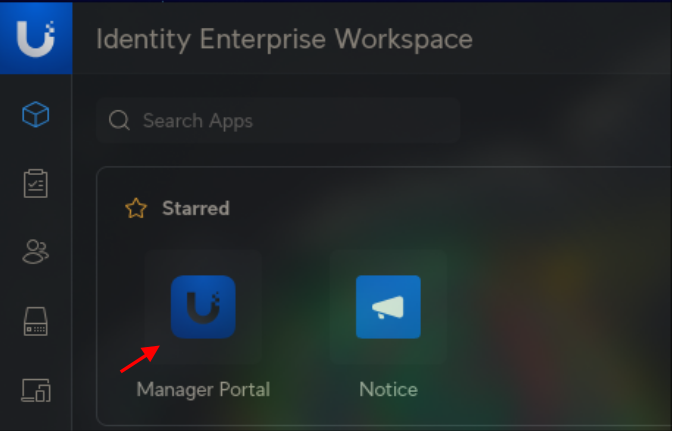
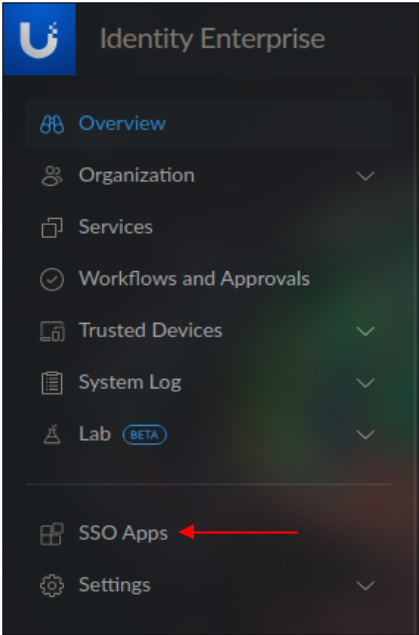
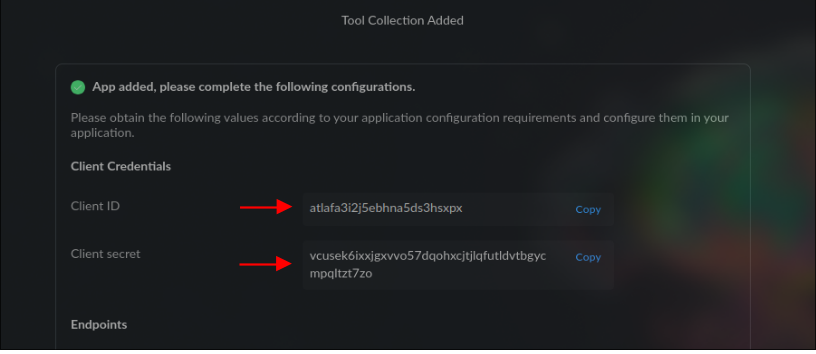
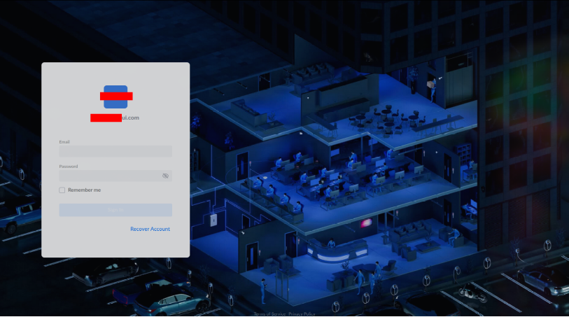

# UniFi Identity Enterprise (UID)

## 1. UID Application Configuration

### Step 1: Log in to your Identity Enterprise Workspace

1. Access the UID workspace (e.g., `https://your-site.ui.com`).
2. Log in with your credentials.



### Step 2: Navigate to the Manager portal and create a new application

1. Select the `Manager Portal`. You will be prompted to verify with MFA.
2. Once signed in select `SSO Apps` in the left-hand menu.
3. Press the Plus button in the top right-hand corner.
4. Select `Add Custom App`
5. Select `OIDC` from the menu
6. Fill in the details for your application.
   The crucial fields needed are `Initiate Sign-In URI` and `Sign-In Redirect URI`.

   Initiate Sign-In URI - (e.g., `https://voucher.example.com`)
   Sign-In Redirect URI - (e.g., `https://voucher.example.com/callback`)

7. Press Add. You will now be presented with your Tool Collection for the app. Copy your `Client ID`, `Client Secret` and the value form your `Well Known Config Endpoint`.
8. Press Done. You can now assign users or groups to the application. The setup has been completed UID side.







### Step 3: Create or update your application configuration

> Attention!: UID currently only supports the `confidential` Client Type.

1. Copy the values from your `Well Known Config Endpoint`, `Client ID` and `Client Secret` into your application configuration. Then set the `AUTH_OIDC_CLIENT_TYPE` to `confidential`.

`docker-compose.yml`
```yaml
      AUTH_OIDC_ISSUER_BASE_URL: 'https://your-site.ui.com/gw/idp/api/v1/public/oauth/your-secret-token/.well-known/openid-configuration'
      AUTH_OIDC_APP_BASE_URL: 'voucher.example.com'
      AUTH_OIDC_CLIENT_ID: 'atlafa3i2j5ebhna5ds3hsxpx'
      AUTH_OIDC_CLIENT_TYPE: 'confidential'
      AUTH_OIDC_CLIENT_SECRET: 'vcusek6ixxjgxvvo57dqohxcjtjlqfutldvtbgycmpqltzt7zo'
```

2. Build your application or update it.

```bash
sudo docker-compose up -d
```

```bash
sudo docker-compose up -d --force-recreate
```

### Testing OIDC Sign-In

**From `UID Workspace`**

Navigate to the Applications section and select your application. This will launch the application. If you followed the steps correctly you should be able to access the voucher site without needing to authenticate.


**External Sign In form outside of UID**

> Notice: You will only be prompted for UID sign-in if you have not signed in within your predefined sign in policy in UID.

Access your application via the `Initiate Sign-In URI` this will prompt a new window to sign in to UID. Once you sign in you will be redirected back to your application.




That's it you now have OIDC setup and can sign in to your application!
