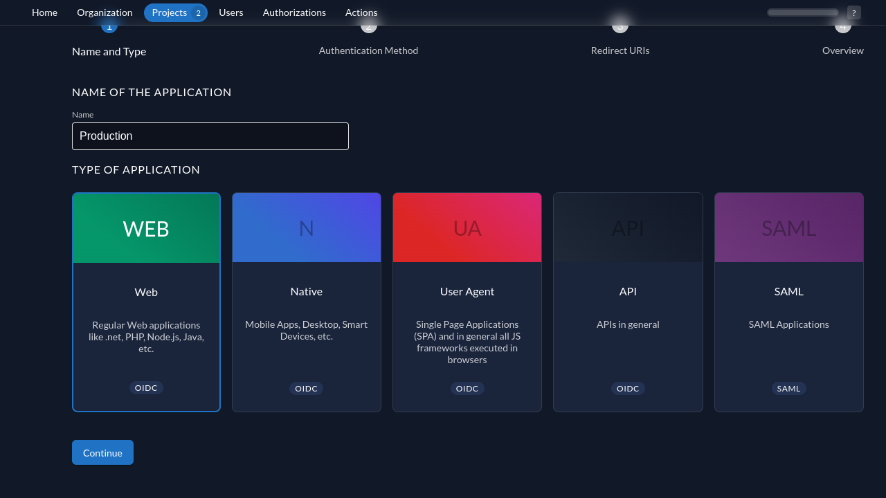
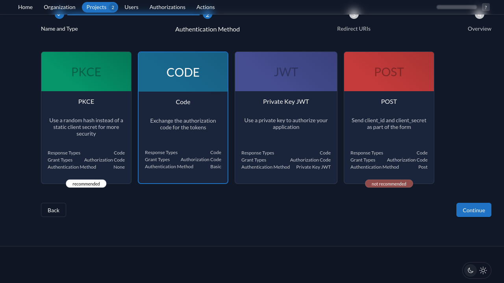
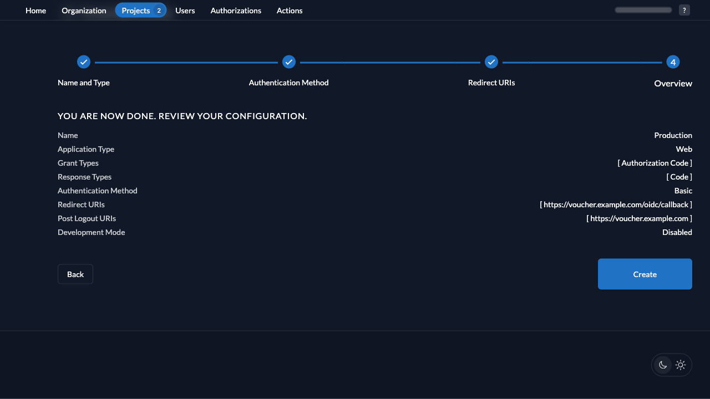

# ZITADEL

## 1. ZITADEL Project and Application Configuration

### Step 1: Log in to the ZITADEL Console

1. Go to your ZITADEL admin console (e.g., `https://auth.example.com`).
2. Log in with your admin credentials.

### Step 2: Create a Project

1. In the ZITADEL console, go to **Projects**.
2. Click **Create New Project**.
3. Name your project (e.g., `UniFi Voucher Site`).
4. Click **Create**.

### Step 3: Create an Application (OAuth2 Client)

Now, create an application under the project you just created.

1. Select your project (e.g., `UniFi Voucher Site`).
2. Under Applications click **Add**.
3. Fill in the following fields and click **Continue**:
    - **Name**: `Production`.
    - **Type**: `Web`.
4. Select **Code** and click **Continue**.
5. Fill in the following fields and click **Continue**:
    - **Login Redirect URIs**: Enter the URL of your UniFi Voucher callback (e.g., `https://voucher.example.com/oidc/callback`).
    - **Logout Redirect URIs**: Enter the root URL of your UniFi Voucher instance (e.g., `https://voucher.example.com`).
6. Click **Create** to save the application.
7. Save the Client ID and Client Secret shown within the popup and click **Close**

---

## 2. UniFi Voucher Site Configuration

Now, configure your UniFi Voucher Site to use the ZITADEL client.

1. Set the `AUTH_OIDC_CLIENT_ID` as the ClientId found within the ZITADEL Popup.
2. Provide the `AUTH_OIDC_CLIENT_SECRET` as the ClientSecret found within the ZITADEL Popup.
3. Provide the `AUTH_OIDC_ISSUER_BASE_URL` from your Keycloak server (e.g., `https://auth.example.com/.well-known/openid-configuration`).
4. Provide the `AUTH_OIDC_APP_BASE_URL` from your UniFi Voucher Site instance (e.g., `https://voucher.example.com`).
5. Restart the container after these changes

---

## 3. Testing and Troubleshooting

1. Test the login flow from your UniFi Voucher Site. It should redirect users to ZITADEL for authentication.
2. After logging in, users should be redirected back to the voucher site with tokens from ZITADEL.

### Common Issues

- **Invalid Redirect URI**: Ensure the callback URI matches what is configured in ZITADEL.
- **Client Secret Errors**: Ensure that the client secret in both ZITADEL and your UniFi configuration match.
