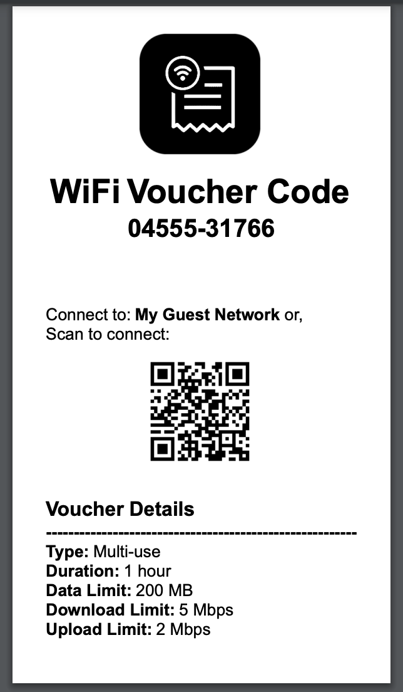
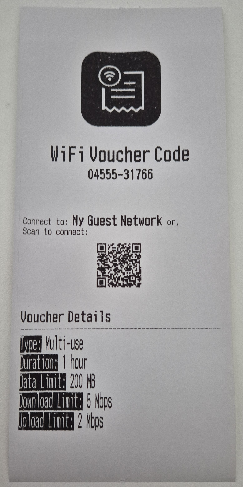
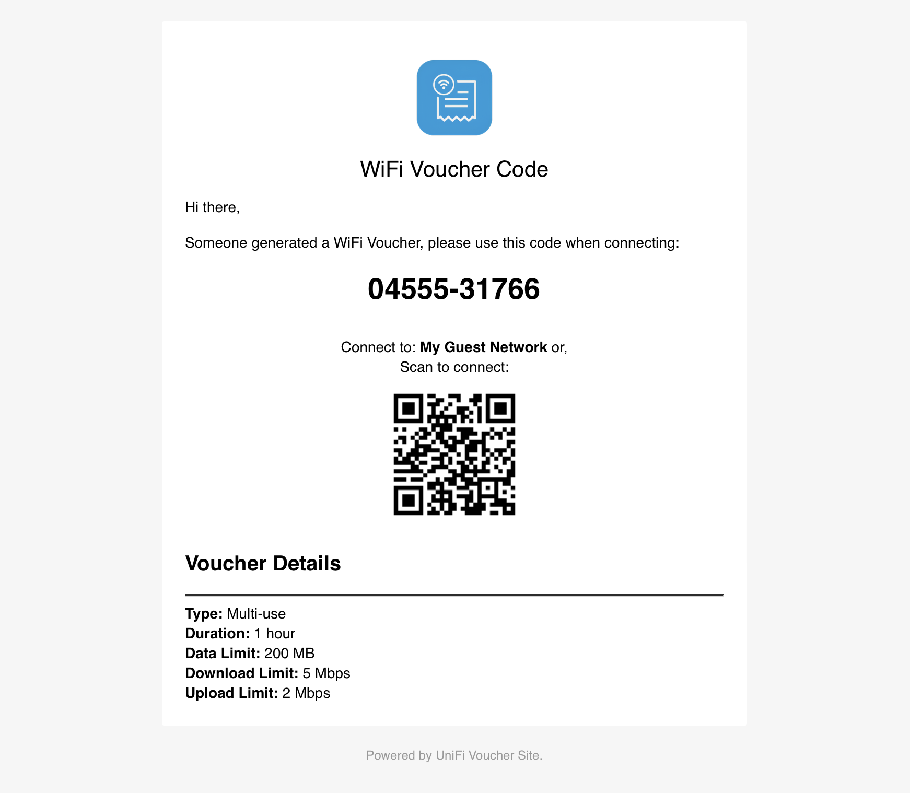
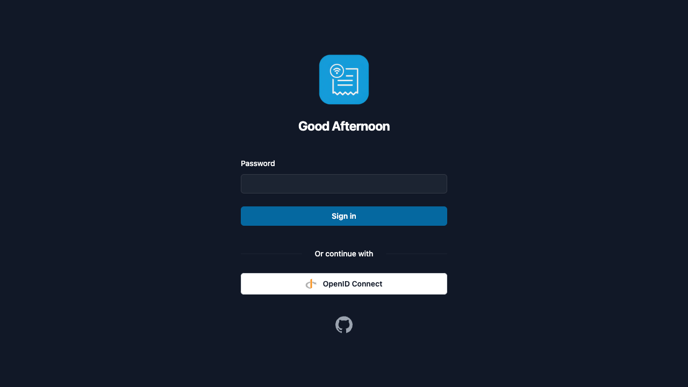
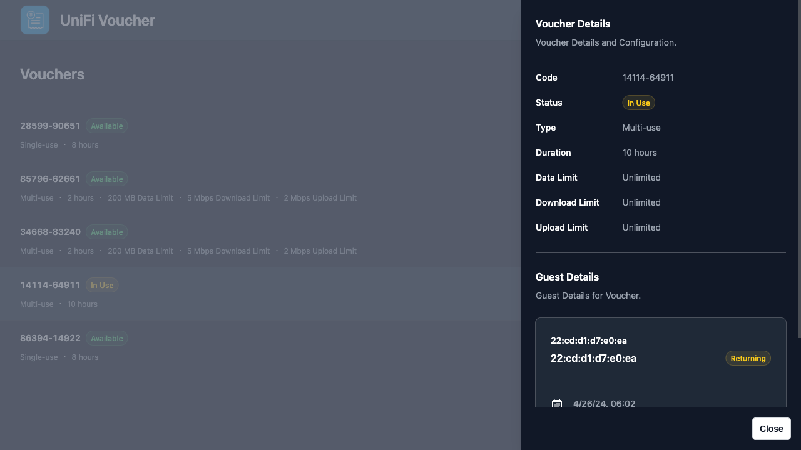
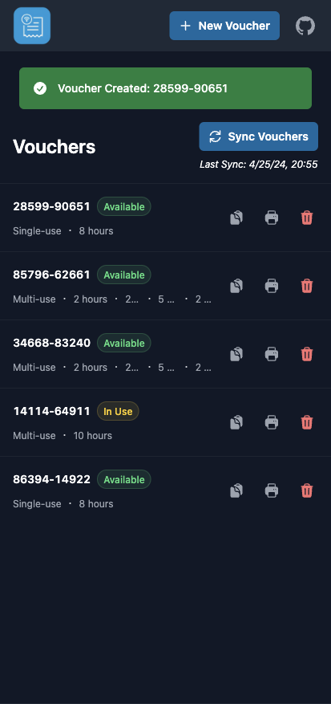
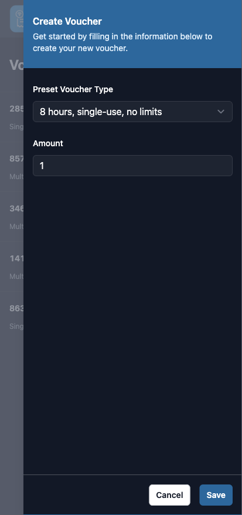
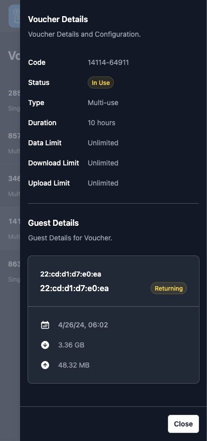

# UniFi Voucher Site

UniFi Voucher Site is a web-based platform for generating and managing UniFi network guest vouchers

[](https://hub.docker.com/r/glenndehaan/unifi-voucher-site)


> Upgrading from 2.x to 3.x? Please take a look at the [migration guide](#migration-from-2x-to-3x)

## Features

- **Voucher Management**: Create, view, and manage vouchers with customizable options for expiration, data limits, and speeds.
- **OIDC Support**: Integrates OpenID Connect for secure user authentication and single sign-on (SSO).
- **Web and API Services**: Access the service via a web interface or integrate with other systems using a REST API.
- **Docker Support**: Easily deploy using Docker, with customizable environment settings.
- **Home Assistant Add-on**: Seamlessly integrate with Home Assistant for centralized management.
- **Receipt Printing**: Supports printing vouchers with 80mm thermal printers.
- **Email Functionality**: Automatically send vouchers via SMTP.

## Structure

- Node.js
- ExpressJS
- EJS
- Node UniFi
- TailwindCSS
- NodeMailer
- PDFKit
- Node Thermal Printer
- QRCode

## Prerequisites

- UniFi Network Controller (Cloud Key, Dream Machine, or Controller software)
- UniFi Access Point (AP)
- UniFi Local Account with 'Full Management' access

[Follow this guide to set up the Hotspot Portal](https://help.ui.com/hc/en-us/articles/115000166827-UniFi-Hotspot-Portal-and-Guest-WiFi), then continue with the installation below

> Ensure voucher authentication is enabled within the Hotspot Portal

> Attention!: We recommend only using Local UniFi accounts due to short token lengths provided by UniFi Cloud Accounts. Also, UniFi Cloud Accounts using 2FA are not supported!

> Note: When creating a Local UniFi account ensure you give 'Full Management' access rights to the Network controller. The 'Hotspot Role' won't give access to the API and therefore the application will throw errors.

## Installation

### Docker

- Code from master is build by GitHub actions
- Builds can be pulled by using this command: `docker pull glenndehaan/unifi-voucher-site`
- An example docker compose file can be found below:

```yaml
version: '3'
services:
  app:
    image: glenndehaan/unifi-voucher-site
    ports:
      - "3000:3000"
    environment:
      # The IP address to your UniFi OS Console
      UNIFI_IP: '192.168.1.1'
      # The port of your UniFi OS Console, this could be 443 or 8443
      UNIFI_PORT: 443
      # The username of a local UniFi OS account
      UNIFI_USERNAME: 'admin'
      # The password of a local UniFi OS account
      UNIFI_PASSWORD: 'password'
      # The UniFi Site ID
      UNIFI_SITE_ID: 'default'
      # The UniFi SSID where guests need to connect to (Used within templating and 'Scan to Connect')
      UNIFI_SSID: ''
      # The UniFi SSID WPA/WPA2/WPA3 Password (Can be ignored for 'Open' networks) (Used within templating and 'Scan to Connect')
      UNIFI_SSID_PASSWORD: ''
      # The password used to log in to the voucher portal Web UI
      AUTH_INTERNAL_PASSWORD: '0000'
      # The Bearer token used for the API
      AUTH_TOKEN: '00000000-0000-0000-0000-000000000000'
      # OIDC issuer base url provided by oauth provider. Example: https://auth.example.com/.well-known/openid-configuration
      AUTH_OIDC_ISSUER_BASE_URL: ''
      # OIDC UniFi Voucher base url (This application). Example: https://voucher.example.com
      AUTH_OIDC_APP_BASE_URL: ''
      # OIDC client id provided by oauth provider
      AUTH_OIDC_CLIENT_ID: ''
      # OIDC client type, public/confidential
      AUTH_OIDC_CLIENT_TYPE: 'public'
      # OIDC client secret provided by oauth provider (Only required when using confidential client type)
      AUTH_OIDC_CLIENT_SECRET: ''
      # Disables the login/authentication for the portal and API
      AUTH_DISABLE: 'false'
      # Voucher Types, format: expiration in minutes (required),single-use or multi-use vouchers value - '0' is for multi-use - '1' is for single-use (optional),upload speed limit in kbps (optional),download speed limit in kbps (optional),data transfer limit in MB (optional)
      # To skip a parameter just but nothing in between the comma's
      # After a voucher type add a semicolon, after the semicolon you can start a new voucher type
      VOUCHER_TYPES: '480,1,,,;'
      # Allow users to create custom vouchers types within the UI
      VOUCHER_CUSTOM: 'true'
      # Enable/disable the Web UI
      SERVICE_WEB: 'true'
      # Enable/disable the API
      SERVICE_API: 'false'
      # Enable/disable the printer and set the preferred type, currently supported types: pdf, escpos
      PRINTER_TYPE: ''
      # IP address to your network enabled ESC/POS compatible printer (Only required when using PRINTER_TYPE: 'escpos')
      PRINTER_IP: '192.168.1.1'
      # SMTP Mail from email address (optional)
      SMTP_FROM: ''
      # SMTP Mail server hostname/ip (optional)
      SMTP_HOST: ''
      # SMTP Mail server port (optional)
      SMTP_PORT: ''
      # SMTP Mail use TLS? (optional)
      SMTP_SECURE: 'false'
      # SMTP Mail username (optional)
      SMTP_USERNAME: ''
      # SMTP Mail password (optional)
      SMTP_PASSWORD: ''
      # Sets the application Log Level (Valid Options: error|warn|info|debug|trace)
      LOG_LEVEL: 'info'
```

### Home Assistant Add-on

For users of Home Assistant, we provide a dedicated add-on to seamlessly integrate the UniFi Voucher Site with your Home Assistant instance. This add-on simplifies the setup process and allows you to manage UniFi vouchers directly from your Home Assistant dashboard.

[](https://my.home-assistant.io/redirect/supervisor_add_addon_repository/?repository_url=https%3A%2F%2Fgithub.com%2Fglenndehaan%2Fha-addons)

#### Manual Installation

To install the UniFi Voucher Site add-on for Home Assistant, follow these steps:

1. Open the Supervisor panel in your Home Assistant instance.
2. Navigate to the "Add-on Store."
3. Add our repository to the list of repositories by clicking the three dots in the upper-right corner, then selecting "Repositories," and entering the URL of our repository: `https://github.com/glenndehaan/ha-addons`.
4. Once the repository is added, you will find the "UniFi Voucher Site" add-on in the add-on store. Click on it.
5. Click "Install" and wait for the installation to complete.

## Development

- Install Node.js 20.0 or higher.
- Run `npm ci` in the root folder
- Run `npm start` & `npm run tailwind` in the root folder

Then open up your favorite browser and go to http://localhost:3000/

## Services

The project consists of two main services: Web and API.

### Web Service

The Web service is a user interface accessible through a web browser. It provides functionality for generating, viewing,
and managing vouchers within the UniFi system.

### API Service

The API service allows programmatic access to voucher-related functionalities. It is designed for developers who wish to
integrate voucher management into their applications or automate voucher generation processes. Below are the details of
the different endpoints available in the API:

#### Endpoints

1. **`/api`**
    - Method: GET
    - Description: Retrieves information about the API and its endpoints.
    - Access: Open
    - Response Example:

```json
{
  "error": null,
  "data": {
    "message": "OK",
    "endpoints": [
      "/api",
      "/api/types",
      "/api/voucher/:type",
      "/api/vouchers"
    ]
  }
}
```

2. **`/api/types`**
    - Method: GET
    - Description: Retrieves a list of available voucher types supported by the system.
    - Response Format: JSON
    - Access: Open
    - Response Example:

```json
{
  "error": null,
  "data": {
    "message": "OK",
    "types": [
      {
        "expiration": "480",
        "usage": "0",
        "raw": "480,0,,,"
      }
    ]
  }
}
```

3. **`/api/voucher/:type`**
    - Method: GET
    - Description: Generates a voucher of the specified type.
    - Parameters:
        - `type` (string): The type of voucher to generate.
    - Response Format: JSON
    - Access: Protected by Bearer Token
    - Response Example:

```json
{
  "error": null,
  "data": {
    "message": "OK",
    "voucher": "12345-67890"
  }
}
```

   > This endpoint is protected by a security mechanism. To access it, users need to include a bearer token in the
   request authorization header. The token must match the value of the `AUTH_TOKEN` environment variable. Without
   this token, access to the endpoint will be denied.

4. **`/api/vouchers`**
    - Method: GET
    - Description: Retrieves a list of available vouchers.
    - Response Format: JSON
    - Access: Protected by Bearer Token
    - Response Example:

```json
{
  "error": null,
  "data": {
    "message": "OK",
    "vouchers": [
      {
        "code": "15695-53133",
        "type": "multi",
        "duration": 60,
        "data_limit": "200",
        "download_limit": "5000",
        "upload_limit": "2000"
      },
      {
        "code": "03004-59449",
        "type": "single",
        "duration": 480,
        "data_limit": null,
        "download_limit": null,
        "upload_limit": null
      }
    ],
    "updated": 1712934667937
  }
}
```

> This endpoint is protected by a security mechanism. To access it, users need to include a bearer token in the
request authorization header. The token must match the value of the `AUTH_TOKEN` environment variable. Without
this token, access to the endpoint will be denied.

## Authentication

The UniFi Voucher Site provides three options for authenticating access to the web service.

> Note that these options only affect the web service; the API service uses a different authentication method, which is explained above.

### 1. Internal Authentication (Default)

By default, the UniFi Voucher Site uses an internal authentication method. You can set the password for this internal authentication using the `AUTH_INTERNAL_PASSWORD` environment variable.

```env
AUTH_INTERNAL_PASSWORD: '0000'
```

### 2. OpenID Connect (OIDC) Authentication

The UniFi Voucher Site allows seamless integration with OpenID Connect (OIDC), enabling users to authenticate through their preferred identity provider (IdP). With support for both Public and Confidential client types. Configuration is easy using environment variables to align with your existing OIDC provider.

#### Configuration

To enable OIDC authentication, set the following environment variables in your application’s environment:

- **`AUTH_OIDC_ISSUER_BASE_URL`**:
  The base URL of your OIDC provider. This is typically the URL where the well-known OIDC configuration is hosted (e.g., `https://auth.example.com/.well-known/openid-configuration`).

- **`AUTH_OIDC_APP_BASE_URL`**:
  The base URL of your UniFi Voucher Site application. This should be the public URL where the site is accessible to users (e.g., `https://voucher.example.com`).

- **`AUTH_OIDC_CLIENT_ID`**:
  The client ID registered with your OIDC provider. This value is specific to the OIDC client created for the UniFi Voucher Site.

- **`AUTH_OIDC_CLIENT_TYPE`**:
  Specify the type of OIDC client:
    - **`public`**: Uses the Implicit flow (default).
    - **`confidential`**: Uses the Authorization Code flow with client secret.

- **`AUTH_OIDC_CLIENT_SECRET`** (required if using the Confidential client type):
  The client secret associated with your OIDC provider, necessary when using the Authorization Code flow.

> Please note that **enabling OIDC support will automatically disable the built-in login system**. Once OIDC is activated, all user authentication will be handled through your configured identity provider, and the local login mechanism will no longer be available.

#### OIDC Client Configuration

When configuring your OIDC client, ensure the following settings are enabled based on your chosen client type:

- **Public Client (Implicit Flow)**: The OIDC client **must** support the Implicit flow. Be sure to enable both the ID token and access token retrieval.
- **Confidential Client (Authorization Code Flow)**: The client secret is required for secure token exchanges.

#### Determine Supported Client Types

To identify which client types your OpenID Connect (OIDC) provider supports (Public or Confidential), you can check the `.well-known/openid-configuration` endpoint. This endpoint contains metadata about the OIDC provider, including the supported flows and grant types.

##### Steps to Check Supported Client Types

1. **Access the `.well-known/openid-configuration` URL:**

   The URL is typically structured like this:
   ```text
   https://auth.example.com/.well-known/openid-configuration
   ```

2. **Look for the `grant_types_supported` Field:**

   In the returned JSON, the `grant_types_supported` field will indicate the flows your provider supports:
    - **For Public Clients (Implicit Flow):** Look for `implicit`.
    - **For Confidential Clients (Authorization Code Flow):** Look for `authorization_code`.

   Example snippet:
   ```json
   {
     "grant_types_supported": [
       "authorization_code",
       "implicit",
       "refresh_token",
       "client_credentials"
     ]
   }
   ```

3. **Check the `response_types_supported` Field:**

   This field also provides details on supported client types:
    - **Implicit Flow:** Should include values like `id_token` or `id_token token`.
    - **Authorization Code Flow:** Should include `code`.

4. **Verify Client Authentication Methods:**

   For confidential clients, confirm that the `token_endpoint_auth_methods_supported` field lists options like `client_secret_post` or `client_secret_basic`, which indicate that the provider supports client secret authentication.

#### OIDC IdP Integration Guides

This section provides integration guides for configuring the UniFi Voucher Site with various OIDC (OpenID Connect) Identity Providers (IdPs). These guides cover the necessary steps for setting up the IdP, configuring client credentials, and integrating the IdP with the UniFi Voucher Site.

##### Available Guides

Below is a list of tested Identity Providers (IdPs) with detailed integration instructions:

- [Keycloak Integration](.docs/oidc/keycloak/README.md)
- [Authentik Integration](.docs/oidc/authentik/README.md)
- [UniFi Identity Enterprise (UID)](.docs/oidc/uid/README.md)
- [ZITADEL Integration](.docs/oidc/zitadel/README.md)

> Integrated with an IdP that is not on the list? Feel free to create a guide for others and contribute it to the project

### 3. Disabling Authentication

If you prefer not to use authentication for the web service, you can disable it entirely by setting the `AUTH_DISABLE` environment variable.

```env
AUTH_DISABLE: 'true'
```

## Print Functionality

The UniFi Voucher Site application includes built-in support for printing vouchers using 80mm receipt printers, offering a convenient way to distribute vouchers in physical format.

### Compatibility

The print functionality is compatible with most 80mm thermal receipt printers commonly used in various industries. These printers typically use thermal printing technology, eliminating the need for ink cartridges and ensuring efficient and cost-effective voucher printing.

### Configuration

To enable the print feature, you need to set the following environment variables:

```env
PRINTER_TYPE: ''
PRINTER_IP: ''
```

Here’s what each variable represents:

- **`PRINTER_TYPE`**: Sets the printer type used by UniFi Voucher Site. Supported options:
    - `pdf`: For generating PDF files formatted for 80mm paper width.
    - `escpos`: For printing directly to network-enabled ESC/POS compatible printers.

- **`PRINTER_IP`**: Specifies the IP address of the network-enabled ESC/POS printer. This variable is only required when `PRINTER_TYPE` is set to `escpos`.

### Usage

#### PDF

If you're using the PDF option, once your 80mm receipt printer is configured and connected to your local client, you can easily export vouchers to pdf from the UniFi Voucher Site application. Simply navigate to the voucher within the interface and click on the "Print" button.

The application will automatically format the voucher for 80mm paper width, ensuring optimal printing results. Depending on your printer settings and preferences, you may adjust print quality, paper type, and other printing parameters to suit your needs.

##### Example PDF



#### ESC/POS

For network-enabled ESC/POS compatible printers, set the `PRINTER_TYPE` to `escpos` and provide the printer's IP address in the `PRINTER_IP` variable. Once configured, you can print vouchers directly to your network printer from the UniFi Voucher Site application.

Just like with PDF printing, navigate to the voucher and click on the "Print" button. The application will send the print job directly to the ESC/POS printer over the network, ensuring quick and seamless voucher printing. Make sure your printer supports ESC/POS commands and is correctly configured to accept print jobs over the network.

##### Tested Printers

- EPSON TM-T88V
- EPSON TM-T20X
- EPSON TM-T82IIIL
- Posman BTP-R880NP
- NetumScan NT-8360 / 80-V

##### Example Print



## Email Functionality

The UniFi Voucher Site includes a convenient email feature that allows you to send vouchers directly to users from the web interface. By configuring the SMTP settings, you can enable email sending and make it easy to distribute vouchers digitally.

### Configuration

To enable the email feature, you need to set the following environment variables with your SMTP server details:

```env
SMTP_FROM: ''
SMTP_HOST: ''
SMTP_PORT: ''
SMTP_SECURE: ''
SMTP_USERNAME: ''
SMTP_PASSWORD: ''
```

Here’s what each variable represents:

- **`SMTP_FROM`**: The sender email address that will appear in the "From" field when users receive the voucher.
- **`SMTP_HOST`**: The hostname or IP address of your SMTP server (e.g., `smtp.example.com`).
- **`SMTP_PORT`**: The port used by your SMTP server (e.g., `587` for TLS or `465` for SSL).
- **`SMTP_SECURE`**: Set to `true` if your SMTP server requires a secure connection (SSL/TLS), or `false` if it does not.
- **`SMTP_USERNAME`**: The username for authenticating with your SMTP server.
- **`SMTP_PASSWORD`**: The password for authenticating with your SMTP server.

These settings allow the application to connect to your SMTP server and send emails on your behalf.

### Usage

Once the SMTP environment variables are configured, the email feature will be available within the UniFi Voucher Site interface. After generating a voucher, you will see an option to send the voucher via email. Enter the recipient's email address, and the application will send the voucher details directly to their inbox.

### Example Email



## Screenshots

### Login (Desktop)


### Vouchers Overview (Desktop)


### Create Voucher (Desktop)


### Voucher Details (Desktop)


### Login (Mobile)


### Vouchers Overview (Mobile)


### Create Voucher (Mobile)


### Voucher Details (Mobile)


## Migration Guide

### Migration from 2.x to 3.x

When upgrading from 2.x to 3.x, the following changes need to be made:

1. **`SECURITY_CODE`** has been replaced by **`AUTH_PASSWORD`**.
    - Update your environment variables configuration to use `AUTH_PASSWORD` instead of `SECURITY_CODE`.

2. **`DISABLE_AUTH`** has been replaced by **`AUTH_DISABLE`**.
    - Replace `DISABLE_AUTH` with `AUTH_DISABLE` in your environment variables.

3. The API bearer token now uses a dedicated variable **`AUTH_TOKEN`**.
    - Ensure that your API token is now stored under the `AUTH_TOKEN` variable and update your implementations to use this new token instead of the `SECURITY_CODE`.

### Migration from 1.x to 2.x

No migration steps are required.

### Migration from Versions Prior to v1

Versions before v1 do not have a direct migration path. If you are using a version earlier than v1, a fresh installation is required. Be sure to back up any important data before proceeding with a re-install.

## License

MIT
